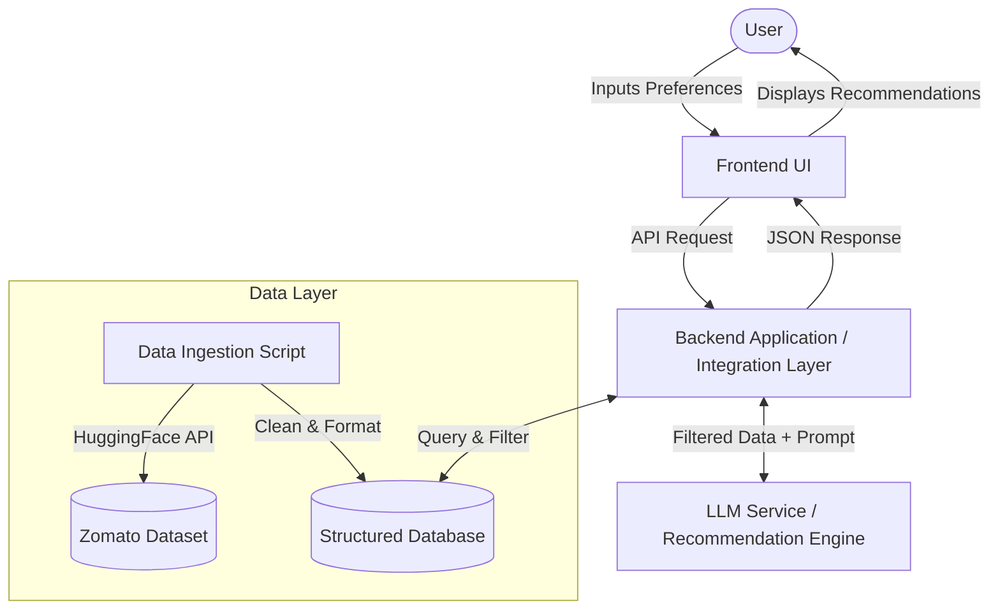

# System Architecture: AI-Powered Restaurant Recommendation

This document outlines the detailed technical architecture for the AI-Powered Restaurant Recommendation System based on the Zomato use case.

## 1. High-Level Architecture

The system follows a standard modern client-server architecture with an integrated Data Pipeline and an external Large Language Model (LLM) service.

## 2. Core Components

### 2.1. Frontend (User Interface)
*   **Role:** The user-facing application where preferences are collected and results are displayed.
*   **Responsibilities:**
    *   Provide a form for deterministic filters (Location, Budget, Cuisine, Minimum Rating).
    *   Provide a text input for fuzzy/additional preferences (e.g., "family-friendly, quiet ambiance").
    *   Display the final ranked recommendations with AI-generated explanations, estimated costs, and ratings in a highly visual and premium format.

### 2.2. Backend (Integration Layer)
*   **Role:** The core orchestrator that connects user requests, the database, and the LLM.
*   **Responsibilities:**
    *   **API Layer:** Expose endpoints (e.g., REST or GraphQL) for the frontend to submit preferences.
    *   **Data Filter Engine:** Perform initial hard filtering on the database (e.g., strictly filtering out restaurants not in the requested location or below the minimum rating). This drastically reduces the context size before sending data to the LLM.
    *   **Prompt Builder:** Construct a well-structured prompt combining the filtered restaurant data (as JSON or Markdown) and the user's specific natural language preferences.
    *   **Response Parser:** Parse the LLM's response to ensure it adheres to the expected format before sending it to the frontend.

### 2.3. Data Ingestion & Storage
*   **Role:** Manages the structured data from the Zomato dataset.
*   **Responsibilities:**
    *   **ETL Pipeline:** A background script/job that downloads the dataset from Hugging Face (`ManikaSaini/zomato-restaurant-recommendation`), cleans missing values, normalizes cost categories, and extracts necessary fields.
    *   **Database:** Stores the processed data for fast querying. A relational database (PostgreSQL) or a document store (MongoDB) is suitable for indexing by location, cuisine, and rating.

### 2.4. LLM Recommendation Engine
*   **Role:** The brain behind the personalized ranking and human-like explanations.
*   **Responsibilities:**
    *   Receive the contextual prompt from the backend.
    *   Reason about the filtered restaurants against the user's specific fuzzy constraints.
    *   Rank the top `N` options and generate a compelling "Why this fits" explanation for each.

## 3. Data Flow (Request Lifecycle)

1.  **User Request:** The user submits their preferences (e.g., "Delhi", "Medium Budget", "Italian", "4+ Rating", "Romantic setup").
2.  **Hard Filtering:** The Backend receives the request and queries the Database:
    `SELECT * FROM restaurants WHERE location = 'Delhi' AND rating >= 4 AND cuisine LIKE '%Italian%' AND budget = 'Medium'`
3.  **Prompt Construction:** The Backend takes the resulting subset of restaurants (e.g., 10-15 matching places) and injects them into a predefined LLM prompt template, along with the user's additional preference ("Romantic setup").
4.  **LLM Inference:** The Backend sends the prompt to the LLM API.
5.  **LLM Response:** The LLM evaluates the subset, selects the top 3-5 restaurants most suitable for a romantic setup, and generates explanations.
6.  **Display:** The Backend relays this structured JSON response to the Frontend, which renders the recommendations to the user.

## 4. Proposed Technology Stack

*   **Frontend:** Next.js (with Tailwind CSS for premium UI styling)
*   **Backend:** Python (FastAPI)
*   **Database:** PostgreSQL (for robust structured querying) or simply SQLite/JSON if building a lightweight local PoC.
*   **LLM Provider:** Groq
*   **Data Ingestion:** Python (Pandas, Hugging Face `datasets` library)
